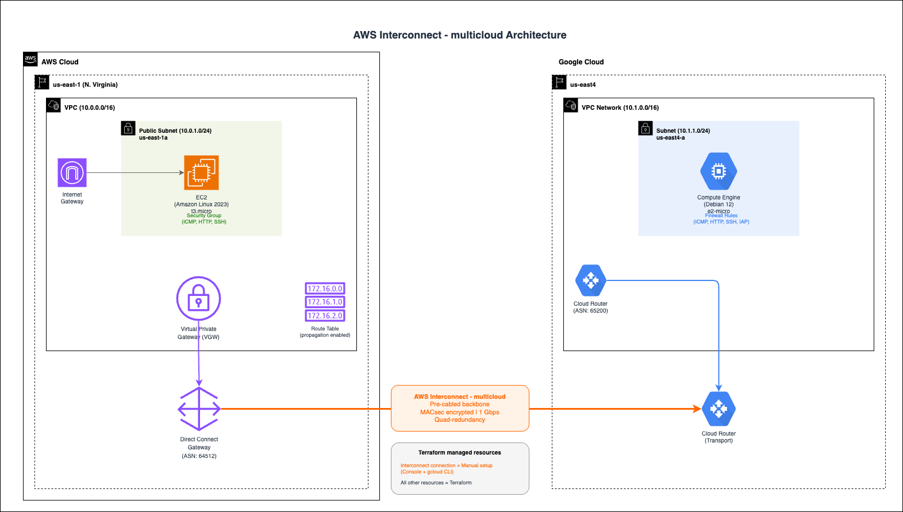

# aws-interconnect-multicloud-rta

AWS Interconnect - multicloudを使ってAWSとGoogle Cloudをプライベート接続RTAするための検証環境をTerraformで構築する。

## アーキテクチャ



### Terraformで作成されるリソース

**AWS側**
- VPC / Public Subnet / Internet Gateway / Route Table (ルート伝搬有効)
- VPN Gateway (VGW)
- Direct Connect Gateway + VGW Association
- EC2 (Amazon Linux 2023, t3.micro, nginx)
- IAM Role / Instance Profile (SSM Session Manager用)
- Security Group (ICMP, HTTP from GCP)

**GCP側**
- VPC Network / Subnet
- Cloud Router (ASN: 65200) / Cloud NAT
- GCE (Debian 12, e2-micro, nginx, 外部IPなし)
- Firewall Rules (IAP SSH, ICMP, HTTP from AWS)

## 前提条件

- Terraform >= 1.5.0
- AWS CLI v2 (>= 2.32.0 推奨、`aws login`を使う場合)
- Google Cloud SDK (gcloud)
- AWSアカウント
- GCPプロジェクト (Network Connectivity APIが有効であること)
- AWS Session Managerプラグイン (`session-manager-plugin`)

## 認証設定

### AWS

#### 方法1: `aws login`

事前設定不要。ブラウザでコンソール認証するだけでCLI/SDKが使える。

```bash
# ログイン（ブラウザが自動起動する）
aws login --region us-east-1

# 認証確認
aws sts get-caller-identity

# ログアウト
aws logout
```

- 初回実行時にリージョンを聞かれるだけで、アクセスキーやSSO設定は不要
- セッションは最大12時間有効、15分ごとに自動更新
- IAMユーザーの場合は`SignInLocalDevelopmentAccess`マネージドポリシーのアタッチが必要

### GCP

```bash
# ユーザー認証（ブラウザが開く）
gcloud auth login

# Terraform用のApplication Default Credentials (ADC)を取得
gcloud auth application-default login

# プロジェクトを設定
gcloud config set project <your-gcp-project-id>

# 認証確認
gcloud auth list
```

## デプロイ手順

### 1. リポジトリのセットアップ

```bash
cd aws-interconnect-multicloud-rta
```

### 2. 変数ファイルの作成

```bash
cp terraform.tfvars.example terraform.tfvars
```

`terraform.tfvars`を編集:

```hcl
# General
project_name = "interconnect-multicloud"

# AWS
aws_region = "us-east-1"

# GCP
gcp_project_id = "your-gcp-project-id"
gcp_region     = "us-east4"
```

リージョンの対応は以下コマンドで確認する

```
# 利用可能なリモートプロファイルを確認
gcloud beta network-connectivity transports remote-profiles list \
  --region us-east4
```

### 3. Terraformの初期化と適用

```bash
# 初期化
terraform init

# 実行計画の確認
terraform plan

# リソース作成
terraform apply
```

### 4. 出力値の確認

```bash
terraform output
```

以下の値がInterconnect接続時に必要:
- `aws_dx_gateway_id` - Interconnect作成時に指定
- `gcp_vpc_name` - Transport作成時に指定
- `gcp_cloud_router_name` - Transport作成時に指定

### 5. Interconnect接続（手動）

Terraform適用後、以下の手順でInterconnect接続を行う。

#### Step 5-1: AWS ConsoleでInterconnect作成

1. AWS Direct Connect Consoleを開く
2. 左メニュー「AWS Interconnect」を選択
3. 「Create new multicloud Interconnect」をクリック
4. 以下を設定:
   - Provider: **Google Cloud**
   - Source: **us-east-1** / Dest: **us-east4**
   - Bandwidth: **1 Gbps**
   - Direct Connect GW: `terraform output aws_dx_gateway_id`の値
   - Google Cloud Project ID: GCPプロジェクトID
5. 作成後に表示される**Activation Key**をコピー

#### Step 5-2: GCP側でTransport作成

CloudShell上で実行する

```bash
# AWS Interconnectで作成されたアクティベーションキーを指定
ACTIVATION_KEY=""

# Transport作成（--activation-keyを使う場合、--bandwidthはキーに含まれるため不要）
gcloud beta network-connectivity transports create interconnect-transport \
  --region=us-east4 \
  --network=interconnect-multicloud-vpc \
  --advertised-routes="10.1.0.0/16" \
  --activation-key="$ACTIVATION_KEY"

# ステータス
gcloud beta network-connectivity transports describe interconnect-transport --region=us-east4 | grep state
```

#### Step 5-3: VPC Peering設定

Transport作成時に返される`peeringNetwork`を使う。

```bash
gcloud beta network-connectivity transports describe interconnect-transport --region=us-east4 | grep peeringNetwork
PEERING_NETWORK=""

gcloud compute networks peerings create aws-peering \
  --network=interconnect-multicloud-vpc \
  --peer-network="$PEERING_NETWORK" \
  --import-custom-routes \
  --export-custom-routes
```

#### Step 5-4: 疎通確認

EC2にはSSM Session Manager、GCEにはIAP tunnel経由で接続する。
ローカルで実行する。

```bash
# EC2にSSM Session Managerで接続
aws ssm start-session --target $(terraform output -raw aws_ec2_instance_id) --region us-east-1

# EC2からGCEへping
ping -c 5 10.1.1.100

# EC2からGCEへHTTP（"I'M GCE!!!" と表示されればOK）
curl http://10.1.1.100/

sudo traceroute -I 10.1.1.100
```

```bash
# GCEにIAP tunnel経由でSSH接続
gcloud compute ssh $(terraform output -raw gcp_gce_name) \
  --zone=$(terraform output -raw gcp_gce_zone) \
  --project=$(terraform output -raw gcp_project_id) \
  --tunnel-through-iap

# GCEからEC2へping
ping -c 5 10.0.1.100

# GCEからEC2へHTTP（"I'M EC2!!!" と表示されればOK）
curl http://10.0.1.100/

sudo traceroute -I 10.0.1.100
```

## リソースの削除

```bash
# Interconnect接続を先に削除すること（手動）
# 1. GCP側: VPC Peering削除 → Transport削除
# 2. AWS側: Interconnect削除

# Terraformリソースの削除
terraform destroy
```
